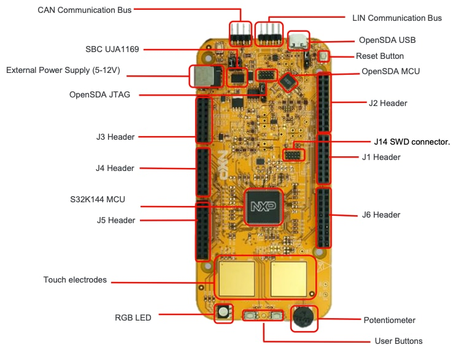

# S32K144 EVB Quick Start Guide

> - REV4.3
>
> - Applies for: S32K144 EVB (SCH-29248 REV B)

## Get to Know S32K144 EVB

- CAN Communication Bus

- LIN Communication Bus

- OpenSDA USB

- Reset Button

- External Power Supply (5-12V)

- SBC UJA1169

- OpenSDA MCU OpenSDA JTAG

- J2 Header

- J3 Header

- J1 Header

- J4 Header

- J14 SWD connector

- S32K144 MCU

- J6 Header

- J5 Header

- Touch electrodes

- RGB LED

- User Buttons

- Potentiometer

### S32K144 EVB Features:

- Supports S32K144 100LQFP

- Small form factor size supports up to 6" x 4"

- Arduino™ UNO footprint-compatible with expansion "shield" support

- Integrated open-standard serial and debug adapter (OpenSDA) with support for several industry-standard debug interfaces

- Easy access to the MCU I/O header pins for prototyping

- On-chip connectivity for CAN, LIN, UART/SCI

- SBC UJA1169 and LIN phy TJA1027

- Potentiometer for precise voltage and analog measurement

- RGB LED

- Two push-button switches (SW2 and SW3) and two touch electrodes

- Flexible power supply options

    - microUSB or

    - external 12V power supply

### Header/Pinout Mapping for S32K144

#### J3

|PIN|PORT|FUNCTION|PIN|PORT|FUNCTION|
|-|-|-|-|-|-|
|J3-02|PTB6*|GPIO|J3-01||VIN|
|J3-04|PTB7*|GPIO|J3-03||IOREF|
|J3-06|PTE0|GPIO|J3-05|PTA5|RESET|
|J3-08|PTE9|GPIO|J3-07||3V3|
|J3-10|PTC5|GPIO|J3-09||5V|
|J3-12|PTC4|GPIO|J3-11||GND|
|J3-14|PTA10|GPIO|J3-13||GND|
|J3-16|PTA4|GPIO|J3-15||VIN|

- *0ohm resistor is not connected

#### J4

|PIN|PORT|FUNCTION|PIN|PORT|FUNCTION|
|-|-|-|-|-|-|
|J4-02|PTC7|GPIO|J4-01|PTD4|ADC0|
|J4-04|PTC6|GPIO|J4-03|PTB12|ADC1|
|J4-06|PTB17|GPIO|J4-05|PTB0|ADC2|
|J4-08|PTB14|GPIO|J4-07|PTB1|ADC3|
|J4-10|PTB15|GPIO|J4-09|PTA6/PTE11/PTA2|ADC4|
|J4-12|PTB16|GPIO|J4-11|PTC0/PTE10/PTA3|ADC5|
|J4-14|PTC14|GPIO|J4-13|PTE2|ADC6|
|J4-16|PTC3|GPIO|J4-15|PTE6|ADC7|

#### J5

|PIN|PORT|FUNCTION|PIN|PORT|FUNCTION|
|-|-|-|-|-|-|
|J5-02|PTE16|GPIO|J5-01|PTA15/PTD11|ADC8|
|J5-04|PTE15|GPIO|J5-03|PTA16/PTD10|ADC9|
|J5-06|PTE14|GPIO|J5-05|PTA1|ADC10|
|J5-08|PTE13|GPIO|J5-07|PTA0|ADC11|
|J5-10||VDD|J5-09|PTA7|ADC12|
|J5-12||GND|J5-11|PTB13|ADC13|
|J5-14|PTE1|GPIO|J5-13|PTC1|ADC14|
|J5-16|PTD7|GPIO|J5-15|PTC2|ADC15|
|J5-18|PTD6|GPIO|J5-17|NC|GPIO|
|J5-20|PTC15|GPIO|J5-19|NC|N/A|

#### J2

|PIN|PORT|FUNCTION|PIN|PORT|FUNCTION|
|-|-|-|-|-|-|
|J2-19|PTE10/PTA3|D15/I2C_SDA|J2-20|NC|GPIO|
|J2-17|PTE11/PTA2|D14/I2C_CLK|J2-18|NC|GPIO|
|J2-15||ANALOGUE|REF|J2-16|PTA14|GPIO|
|J2-13||GND|J2-14|PTE7|GPIO|
|J2-11|PTB2|D13/SPI_SCK|J2-12|PTC13|GPIO|
|J2-09|PTB3|D12/SPI_SIN|J2-10|PTC12|GPIO|
|J2-07|PTB4|D11/SPI_SOUT|J2-08|PTE8|GPIO|
|J2-05|PTB5|D10/SPI_CS|J2-06|PTD0|GPIO|
|J2-03|PTD14|D9/PWM|J2-04|PTD16|GPIO|
|J2-01|PTD13|D8/PWM|J2-02|PTD15|GPIO|

#### J1

|PIN|PORT|FUNCTION|PIN|PORT|FUNCTION|
|-|-|-|-|-|-|
|J1-15|PTC11/PTE8|D7|J1-16|PTE3|GPIO|
|J1-13|PTC10/PTC3|D6|J1-14|PTD3|GPIO|
|J1-11|PTB11|D5|J1-12|PTD5|GPIO|
|J1-09|PTB10|D4|J1-10|PTD12|GPIO|
|J1-07|PTB9|D3|J1-08|PTD11|GPIO|
|J1-05|PTB8|D2|J1-06|PTD10|GPIO|
|J1-03|PTA3|D1|J1-04|PTA17|GPIO|
|J1-01|PTA2|D0|J1-02|PTA11|GPIO|

#### J6

|PIN|PORT|FUNCTION|PIN|PORT|FUNCTION|
|-|-|-|-|-|-|
|J6-19|PTA9|D14|J6-20|PTE4|GPIO|
|J6-17|PTA8|D15|J6-18|PTE5|GPIO|
|J6-15|PTE12|D16|J6-16|PTA12|GPIO|
|J6-13|PTD17|D17|J6-14|PTA13|GPIO|
|J6-11|PTC9|D18|J6-12||GND|
|J6-09|PTC8|D19|J6-10||VDD|
|J6-07|PTD8|D20|J6-08|PTC16|GPIO|
|J6-05|PTD9|D21|J6-06|PTC17|GPIO|
|J6-03|PTD2|GPIO|J6-04|PTD3|GPIO|
|J6-01|PTD0|GPIO|J6-02|PTD1|GPIO|

### Jumper Settings

|Jumper|Configuration|Description|
|-|-|-|
|J104|1-2 2-3 (Default)|Reset signal to OpenSDA, use to enter into OpenSDA Bootloader mode Reset signal direct to the MCU, use to reset S32K144.|
|J107|1-2 2-3 (Default)|S32K144 powered by 12V power source. S32K144 powered by USB micro connector.|
|J109/J108|1-2 (Default)|Removes CAN termination resistor|

### HMI mapping

|Component|S32K144|
|-|-|
|Red LED|PTD15 (FTM0 CH0)|
|Blue LED|PTD0(FTM0 CH2)|
|Green LED|PTD16(FTM0 CH1)|
|Potentiometer|PTC14|(ADC0_SE12)|
|SW2|PTC12|
|SW3|PTC13|
|OpenSDA UART TX|PTC7(LPUART1_TX)|
|OpenSDA UART RX|PTC6(LPUART1_RX)|
|CAN TX|PTE5(CAN0_TX)|
|CAN RX|PTE4 (CAN0_RX)|
|LIN TX|PTD7(LPUART2_TX)|
|LIN RX|PTD6 (LPUART2_RX)|
|SBC_SCK|PTB14 (LPSPI1_SCK)|
|SBC_MISO|PTB15(LPSPI1_SIN)|
|SBC_MOSI|PTB16(LPSPI1_SOUT)|
|SBC_CS|PTB17(LPSPI1_PCS3)|

## JumpStart Setup

### Step 1: Power up the Board

#### EVB Power Supplies

- The S32K144-EVB evaluation board powers from a USB or external 12V power supply.

    - By default USB power is enabled with J107.

- Connect the USB cable to a PC using supplied USB cable.

- Connect other end of USB cable (microUSB) to mini-B port on FRDM-KEA at J7

- Allow the PC to automatically configure the USB drivers if needed

- Debug is done using OpenSDA through J7

#### Is it powered on correctly?

- When powered through USB, LEDs D2 and D3 should light green.

- Once the board is recognized, it should appear as a mass storage device in your PC with the name EVB-S32K144. 

- Board is preloaded with a software, in which the red, blue and green leds will toggle at different rates.

## JumpStart based on the FreeMASTER tool

### Install the FreeMASTER tool

- Download and install the FreeMASTER PC application www.nxp.com/FreeMASTER.

- Open the FreeMASTER application on your PC.

        - You should see Welcome page.

### Power up the EVB board

- Powers the S32K144EVB evaluation board from a USB.

    - By default, the USB power is enabled by J107 jumper (2-3 closed).

- Connect the USB cable to a PC and connect micro USB connector of the USB cable to micro-B port J7 on the S32K144EVB.

- Allow the PC to automatically configure the USB drivers if needed.

- When EVB is powered from USB, LEDs D2 and D3 should light green.

- The EVB board is preloaded with a software toggling the RGB LED colours periodically between RED-GREEN-BLUE.

### Setup serial connection in the FreeMASTER tool

- Setup communication port to "opensda" and speed to 115200 b/s:

    - Setup communication manualy: "Project > Options > Comm" or

    - Setup communication automatically: "Tools > Connection Wizard"

### The FreeMASTER JumpStart project will be automaticaly downloaded from www.nxp.com

- Once the FreeMASTER application detects the web address stored as an TSA active content in the flash memory of the S32K144 MCU, the download of the FreeMASTER project from www.nxp.com will be initiated.

### The FreeMASTER JumpStart project is loaded

### The FreeMASTER JumpStart project description 

- Pins of the J2, J1 and J6 connectors are configured as outputs.

- By single click on each pin you can change their logical level to log0 or log1.

- User can connect e.g. LED diodes to these ouput pins.

- Pins of the J3, J4 and J5 connectors are configured as inputs.

- Logical level (log0/log1) is visualised for all connector pins.

- User can connect e.g. push-button keyboard to these input pins. 

- Links to S32K14x docs:

    - Fact Sheet

    - Data Sheet

    - Reference Manual

    - Product Brief

    - S32K144EVB schematic

    - S32K144EVB Quick Start Guide

    - Tools:

        - FreeMASTER

        - S32 Design Studio IDE

    - S32K144EVB OOBE source files

### The FreeMASTER JumpStart oscilloscope feature examples

- Display main project panel "Project > View > Project Tree".

- Display real-time oscilloscope graph examples such as "Potentiometer" or "Touch Sense Electrodes".

## Introduction to OpenSDA

- OpenSDA is an open-standard serial and debug adapter.

- It bridges serial and debug communications between a USB host and an embedded target processor.

- OpenSDA software includes a flash-resident USB mass-storage device (MSD) bootloader and a collection of OpenSDA Applications.

- S32K144 EVB comes with the MSD Flash Programmer OpenSDA Application preinstalled.

- Follow these instructions to run the OpenSDA Bootloader and update or change the installed OpenSDA Application.

#### Enter OpenSDA Bootloader Mode

1. Unplug the USB cable if attached

2. Set J104 on position 1-2.

3. Press and hold the Reset button (SW5)

4. Plug in a USB cable (not included) between a USB host and the OpenSDA USB connector (labeled "SDA")

5. Release the Reset button

- A removable drive should now be visible in the host file system with a volume label of BOOTLOADER.

- You are now in OpenSDA Bootloader mode.

> ##### IMPORTANT NOTE
>
> - Follow the "Load an OpenSDA Application" instructions to update the MSD Flash Programmer on your S32K144 EVB to the latest version.

#### Load an OpenSDA Application

1. While in OpenSDA Bootloader mode, double-click ***SDA_INFO.HTML*** in the ***BOOTLOADER*** drive.

    - A web browser will open the OpenSDA homepage containing the name and version of the installed Application.

    - This information can also be read as text directly from ***SDA_INFO.HTML***.

2. Locate the ***OpenSDA Applications***.

3. Copy & paste or drag & drop the MSD Flash Programmer Application to the ***BOOTLOADER*** drive.

4. Unplug the USB cable and plug it in again.

    - The new OpenSD AApplication should now be running and a ***S32K144 EVB*** drive should be visible in the host file system.

- You are now running the latest version of the MSD Flash Programmer.

- Use this same procedure to load other OpenSDA Applications.

 

- The MSD Flash Programmer is a composite USB application that provides a virtual serial port and an easy and convenient way to program applications into the KEA MCU.

- It emulates a FAT16 file system, appearing as a removable drive in the host file system with a volume label of EVB-S32K144.

- Raw binary and Motorola S-record files that are copied to the drive are programmed directly into the flash of the KEA and executed automatically.

- The virtual serial port enumerates as a standard serial port device that can be opened with standard serial terminal applications.

#### Using the MSD Flash Programmer

1. Locate the .srec file of your project, file is under the Debug folder of the S32DS project.

2. Copy & paste or drag & drop one of the .srec files to the EVB-S32K144 drive

- The new application should now be running on the S32K144 EVB.

- Starting with v1.03 of the MSD Flash Programmer, you can program repeatedly without the need to unplug and reattach the USB cable before reprogramming.

 

- Drag one of the .srec code for the S32K144 the S32K144 EVB board over USB to reprogram the preloaded code example to another example.

> ##### NOTE
>
> - Flash programming with the MSD Flash Programmer is currently only supported on Windows operating systems.
>
> - However, the virtual serial port has been successfully tested on Windows, Linux and Mac operating systems.

#### Using the Virtual Serial Port

1. Determine the symbolic name assigned to the EVB-S32K144 virtual serial port.

    - In Windows open Device Manager and look for the COM port named "PEMicro/Freescale -- CDC Serial Port".

2. Open the serial terminal emulation program of your choice.

    - Examples for Windows include Tera Term, PuTTY, and HyperTerminal.

3. Press and release the Reset button (SW0) at anytime to restart the example application.

    - Resetting the embedded application will not affect the connection of the virtual serial port to the terminal program.

4. It is possible to debug and communicate with the serial port at the same time, no need to stop the debug.

> ##### NOTE
>
> - Refer to the OpenSDA User’s Guide for a description of a known Windows issue when disconnecting a virtual serial port while the COM port is in use. 

## Creating a new S32DS project for S32K144

### Download S32DS

- Download S32DS from: http://www.nxp.com/S32DS

### Create New Project

#### First Time -- Select a Workspace

- Start program: Click on “S32 Design Studio for ARM v1.3” icon

- Select workspace:

    - Choose default or specify new one

    - Suggestion: Uncheck the box "Use this as the default and do not ask again"

    - Click OK

#### Top Menu Selection

- File - New - Project

#### S32DS Project

- Project Name:

- Project Type:

    - Select from inside executable or library folder

- Next

- Select Debugger Support and Library Support

- Click Finish

### OpenSDA Configuration

- To Debug your project with OpenSDA, it is necessary to select the OpenSDA in the Debug Configuration.

- Select your project, and click on debug configuration

- Select the Debug configuration under GDB PEMicro Interface Debugging

- Click on Debugger tab

- Select OpenSDA as the interface, if your board is plugged should appear in the Port field.

- Click Apply and debug to finish.

## S32DS Debug basics

### Debug Basics

#### Starting the Debugger

- Debug configuration is only required once.

- Subsequent starting of debugger does not require those steps.

- Three options to start debugger:

    - If the "Debug Configuration" has not been closed, click on "Debug" button on bottom right

    - Select Run -- Debug (or hit F11)

    > ##### Note
    >
    > - This method currently selects the desktop target (project.elf) and gives an error.
    >
    > - Do not use until this is changed.

    - Recommended Method: Click on pull down arrow for bug icon and select ..._debug.elf target

#### Step, Run, Suspend, Resume

- Step Into (F5)

- Step Over (F6)

- Step Return (F7)

- Run

- Suspend

- Resume (F8)

#### View & Alter Variables

- View variables in "Variables" tab.

- Click on a value to allow typing in a different value.

- View CPU registers in the "Registers" tab

- Click on a value to allow typing in a different value

- View peripheral registers in the EmbSys Registers tab

- Add Memory Monitor

- Select Base Address to Start at

- View Memory

#### Breakpoints

- Add Breakpoint: Point and Click

- light blue dot represents debugger breakpoint

#### Reset & Terminate Debug Session

- Reset program counter

- Terminate (Ctl+F2)

## Create a P&E debug configuration

### New P&E debug configuration

- Click in debug configurations

- Create a new P&E launch configuration

    - Click to create a new P&E launch

    - Click on the debugger tab.

- Select S32K144 device

- Click Apply and debug your application
