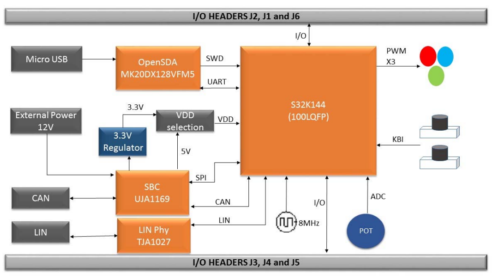
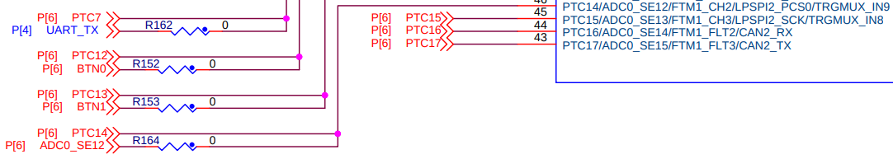
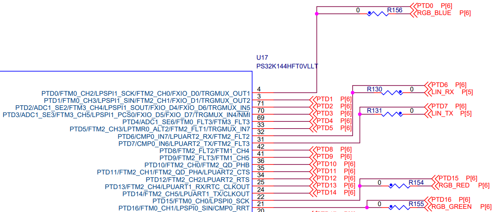
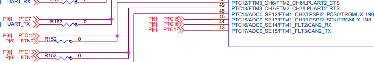
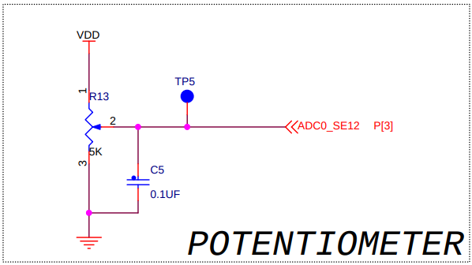
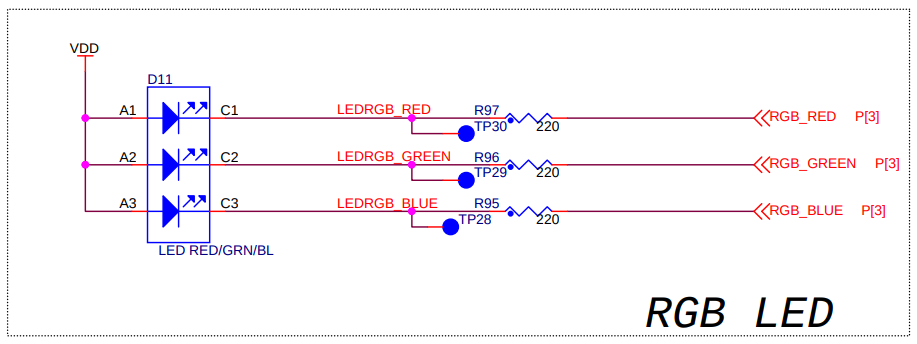
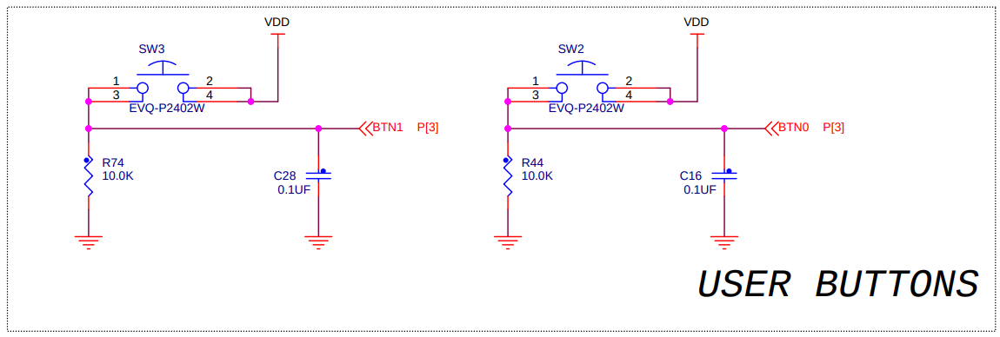

# S32K144EVB-Q100

> Date: Friday, September 02, 2016

## Notes and Block Diagram

1. Unless Otherwise Specified

    - All resistors are in ohms, 1% and 5%

    - All capacitors are in uF, 10%, 20% and 5%

    - All voltages are DC

    - All polarized capacitors are aluminum electrolytic

2. Interrupted lines coded with the same letter or letter combinations are electrically connected.

3. Device type number is for reference only.

    - The number varies with the manufacturer.

4. Special signal usage:

    - \_B Denotes - Active-Low Signal

    - <> or [] Denotes - Vectored signals

5. Interpret diagram in accordance with American National Standards Institute specifications, current revision, with the exception of logic block symbology.



## S32K144 MCU

- POTENTIOMETER

    

    ```mermaid
    flowchart LR
        adc0_se12[ADC0_SE12] --- ptc14["PTC14/ADC0_SE12/FTM1_CH2/LPSPI2_PCS0/TRGMUX_IN9"]
    ```

- RGB LED

    

    ```mermaid
    flowchart LR
        ptd0["PTD0/FTM0_CH2/LPSP1_SCK/FTM2_CH0/FXIO_D0/TRGMUX_OUT1"] --- blue[RGB_BLUE]
        ptd15["PTD15/FTM0_CH0/LPSPI0_SCK"] --- red[RGB_RED]
        ptd16["PTD16/FTM0_CH1/LPSPI0_SIN/CMP0_RRT"] --- green[RGB_GREEN]
    ```
- USER BUTTONS

    

    ```mermaid
    flowchart LR
        btn0[BTN0] --- ptc12["PTC12/FTM3_CH6/FTM2_CH6/LPUART2_CTS"]
        btn1[BTN1] --- ptc13["PTC13/FTM3_CH7/LPUART2_RTS"]
    ```

## I/O Headers

- POTENTIOMETER

    

- RGB LED

    

- USER BUTTONS

    
