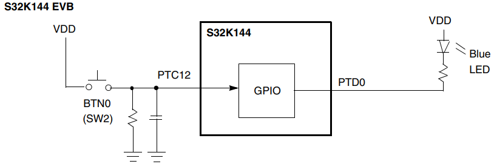
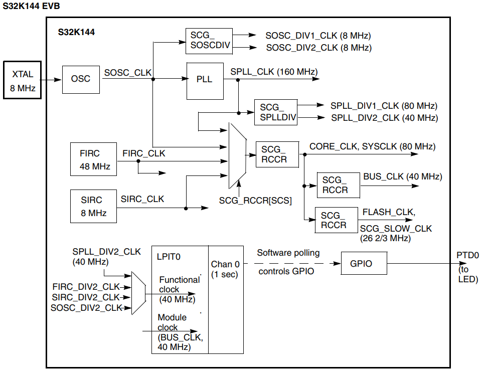
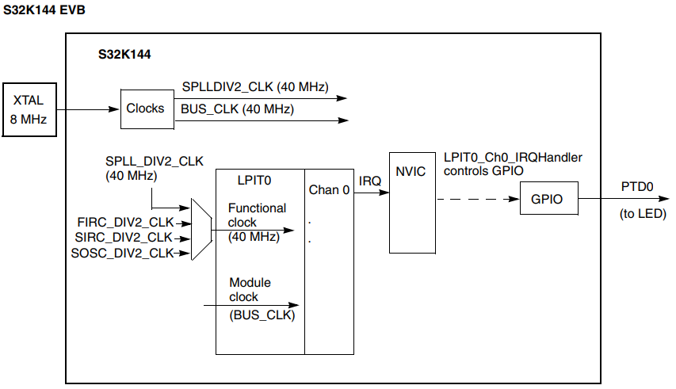
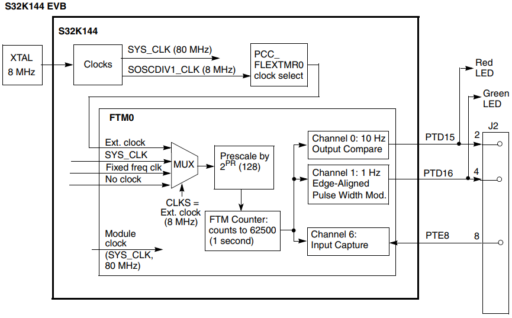
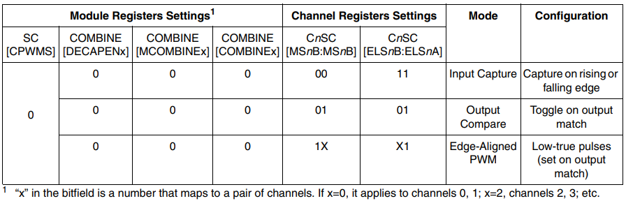
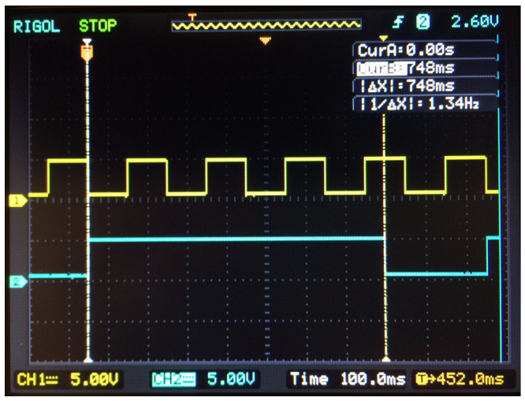
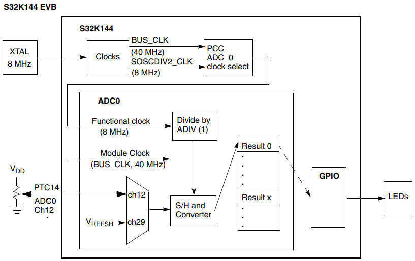

# S32K1xx Series Cookbook

> - Software examples and startup code to exercise microcontroller features by NXP Semiconductors 

## 1 Introduction

- This application note provides software examples and describes necessary startup steps needed to help users get started with S32K1xx series MCUs.

<br>

- This document describes some of the examples provided, but the complete source codes, projects and documentation are available in a public repository at https://github.com/nxp-auto-support/S32K1xx_cookbook.git.

- Projects are implemented using NXP's S32 Design Studio v 3.3 and tested on the S32K144 evaluation board version S32K144EVB-Q100.

- To access the projects and their corresponding documentation:

    - Refer to the Section 6 to import the examples mentioned here, and additional examples for the S32K14x and S32K11x.

    - The documentation of each project provides to the client with a small explanation of the modules and a summary of the functions and/or drivers used.

        - Refer to Section 6 for further detailed.

- These examples and others are also ported to ARM<sup>®</sup> Keil<sub>TM</sub> MDK tools.

- See ARMKeil Application Note 304 at http://www.keil.com/appnotes/docs/apnt_304.asp for further information.

## 2 Software examples

- The table below lists the examples in this application note.

- The three Hello World examples are intended to be base projects that can be copied and code added to create a new project.

#### Table 1. List of examples

##### Hello World

- Program: hello

- hello Simplest project:

    - Configure GPIO

    - Output to LED follows switch input

##### Hello World + Clocks

- Program: hello_clocks

- Perform common initialization for clocks and LPIT:

    - Initialize System Oscillator (SOSC) for 8 MHz crystal

    - Initialize SPLL with 8 MHz SOSC input to provide 80 MHz clock

    - Change Normal RUN mode clock from default FIRC to 160 MHz SPLL (before dividers)

    - Initialize LPIT channel to count 40M clocks (1 second timeout)

    - Toggle output to LED every LPIT timeout

##### Hello World + Clocks + Interrupts

- Program: hello_clocks_interrupts

- The Hello World + Clock example is modified to service the PIT channel timeout with an interrupt service route:

    - Initialize system clock to 80 MHz

    - Initialize an LPIT channel for 1 second timeout and enable its interrupt

    - Wait forever

    - At LPIT timeout interrupt, toggle output to LED

##### DMA

- Program: eDMA

- Transfer a string of bytes to a single byte location:

    - Initialize a Transfer Control Descriptor (TCD)

    - Use software (instead of peripheral DMA requests) to initiate transfers

##### Timed I/O (FTM)

- Program: FTM

- Perform common timed I/O functions with FTM:

    - Module counter initialization

    - Pulse Width MOdulation

    - Output Compare

    - Input Capture

##### ADC - SW Trigger

- Program: ADC

- Perform simple analog to digital conversions using software trigger:

    - Initialize ADC for SW trigger, continuous mode

    - Loop:

        - Convert channel connected to pot on evaluation board

        - Scale result to 0 to 5000 mV

        - Light evaluation board LEDs to reflect voltage level

        - Convert channel connected to the ADC high reference voltage

##### UART

- Program: UART

- Transmit and receive characters:

    - Initialize UART for 9600 baud, 1 stop, no parity

    - Loop:

        - Transmit string, then a prompt character on new line

        - When character is received, echo it back

##### SPI

- Program: LPSPI

- Transmit and receive a SPI frame:

     - Initialize LPSPI for 1M Baud, PCS3 which is connected to SPC on EVB

     - Wait for Tx FIFO to have at least one available slot then issue transmit

     - Wait for Rx FIFO to have at least one received frame then read data

##### CAN 2.0

- Program: FlexCAN

- Transmit and receive an eight byte CAN 2.0 message at 500 KHz:

    - Initialize FlexCAN and Message Buffer 4 to receive a message

    - Transmit one frame using Message Buffer 0

    - Loop:

        - If Message Buffer 4 received message flag is set, read message

        - If Message Buffer 0 transmit done flag is set, transmit another message

##### CAN FD

- Program: FlexCAN_FD

- Transmit and receive a 64 byte CAN FD message at 500 KHz and 1 or 2 MHz:

    - Initialize FlexCAN and Message Buffer 4 to receive a message

    - Transmit one frame using Message Buffer 0

    - Loop:

        - If Message Buffer 4 received message flag is set, read message

        - If Message Buffer 0 transmit done flag is set, transmit another message

### 2.1 Hello World

#### 2.1.1 Description

> ##### Summary
>
> - This short project is a starting point to learn GPIO.
>
> - An input is polled to detect a high or low level.
>
> - An output is set depending on input state.
>
> - If running code on the S32K14x evaluation board, pressing button 0 lights up the blue LED per the diagram below.

> ##### Figure 1. Hello World block diagram
>
> 

#### 2.1.2 Design

- Initialization before main:

    - Define interrupt addresses (such as Reset_Handler) and flash configuration

    - Initialize stack pointer, registers

    - Disable watchdog if configured

    - Initialize vector table

    - Copy variables from ROM to RAM and zero out data section (.bss)

    - Unmask interrupts

- Disable watchdog

- Enable clocks to GPIO modules and configure GPIO ports:

    - PTC12: GPIO input (goes to BTN 0 on evaluation board)

    - PTD0: GPIO output (goes to blue LED)

- Loop:

    - If BTN0 is pressed (input = 1),

        - Turn LED on (output = 0)

    - else (input = 0)

        - Turn LED off (output = 1)

#### 2.1.3 Code

- [hello.c](hello.c)

### 2.2 Hello World + Clocks

#### 2.2.1 Description

> ##### Summary
>
> - This project provides common initialization for clocks and an LPIT channel counter function.
>
> - Core clock is set to 80 MHz.
>
> - LPIT0 channel 0 is configured to count one second of SPLL clocks.
>
> - Software polls the channel’s timeout flag and toggles the GPIO output to the LED when the flag sets.

> ##### Figure 2. Hello World + Clocks block diagram
>
> 

> ##### Table 3. Clocks, divider requirements and common configurations
>
> |Clock|Divider|Requirements|Slow RUN (typically with FIRC)|Normal RUN (with SPLL)|High Speed RUN (with SPLL)|Very Low Power RUN, VLPR (with SIRC or SOSC)|
> |-|-|-|-|-|-|
> |CORE_CLK, SYS_CLK|DIVCORE:<br>- >= BUS_CLK|48 MHz|80 MHz (max)|112 MHz (max)|4 MHz|
> |BUS_CLK|DIVBUS:<br>- CORE_CLK divided by integer|48 MHz|40 MHz (max)|56 MHz (max)|4 MHz|
> |FLASH_CLK, SCG_SLOW_CLK|DIVSLOW:<br>- CORE_CLK divided by integer<br>- CORE_CLK / FLASH_CLK = 8 max.|24 MHz|26 2/3 MHz (max)|28 MHz (max)|1 MHz|

- Clock frequencies and relationships are summarized above in Table 2.

- Dividers for CORE_CLK, SYS_CLK, BUS_CLK and FLASH_CLK must be initialized before switching the new clock.

- Dividers will not have the new values until the clock switch is made.

#### 2.2.2 Design

- Initialize port pins:

    - Enable clock to PORT D module

    - PTD0: GPIO output (goes to blue LED)

- Initialize system oscillator (SOSC) for 8 MHz crystal

    - Initialize desired SOSC dividers

    - Configure range, high gain, reference

    - Ensure SOSC Control and Status register is unlocked

    - Enable SOSC in SOSC Control and Status register

    - Wait for SOSC to be valid

- Initialize System PLL (SPLL) to 160 MHz using 8 MHz SOSC

    - Ensure SPLL is disable to allow configuration

    - Initialized desired SPLL dividers

    - Initialize PLL Ref Clk Divider and Sys PLL Multiplier 1

        - Fpll = Fosc / PLL Ref Clockk Divider x System PLL Multiplier / 2 = 8 MHz / 1 x 20 / 2 = 160 MHz

    - Ensure SPLL Control and Status register is unlocked

    - Enable SPLL in SPLL Control and Status register

    - Wait for SPLL to be valid

- Initialize LPIT0 channel 0:

    - Enable clock source of SPLL_DIV2_CLK

    - Enable clock to LPIT0 registers

    - Enable LPIT0 module

    - Initialize channel 0:

        - Timeout = 1 second of clocks

        - Set Mode to 32 bit counter and enable channel 0

- Change Normal RUN mode clock to SPLL

    - Initialize clock dividers for CORE, BUS and FLASH for new target clock frequency

    - Switch system clock input to SPLL (160 MHz before dividers)

- Loop:

    - Wait for LPIT0 channel 0 flag

    - Increment counter, toggle PTD0 GPIO output and clear channel flag

#### 2.2.3 Code

- [hello_clocks.c](hello_clocks.c)

- [clocks_and_modes.c](clocks_and_modes.c)

### 2.3 Hello World + Interrupts

#### 2.3.1 Description

> ##### Summary
>
> - This project is same as the prior one, except an interrupt is implemented to handle the timer flag.
>
> - Instead of software polling the timer flag, the interrupt handler clears the flag and toggles the output.
>
> - The timeout is again one second using SPLL_DIV2_CLK for the LPIT0 timer clock.

> ##### Figure 3. Hello World + Interrupts block diagram
>
> 

- To initialize an interrupt three writes to the NVIC are taken in this example:

    - Clear any prior pending interrupt (in case there was one)

        - Write a 1 to the interrupt # bit in Interrupt Clear Pending Register (ICPR)

    - Enable the desired interrupt #

        - Write a 1 to the interrupt # bit in the Interrupt Set Enable Register (ISER)

    - Set the interrupt's priority

        - Write a priority from 0 to 15 to the appropriate Interrupt Priority register (IP)

- The following table shows the vectors used by core at reset.

- Exceptions 1 through 15 are core exceptions.

- Exception 15 and above are for peripherals, DMA and software interrupts.

> ##### Table 4. S32K144 Vector Table (example using S32 Design Studio)
>
|Address|Contents in Big Endian memory view|Contents as Little Endian format addresses[^1]|Vector #|IRQ # (NVIC interrupt source)|Symbol in file startup_S32K144.S, section .isr_vector, __isr_vector|Description|
|-|-|-|-|-|-|-|
|0x0000 0000|0070 0020|2000 7000|0||__StackTop|Initial stack pointer|
|0x0000 0004|1104 0000|0000 4010|1||Reset_Handler|Initial Program Counter|
|0x0000 0008|4D04 0000|0000 044C|2||NMI_Handler Non-maskable IRQ (NMI) Vector|
|0x0000 000C|4D04 0000|0000 044C|3||HardFault_Handler Hard Fault Vector|
|0x0000 0010|4D04 0000|0000 044C|4||MemManage_Handler MemManage Fault Vector|
|0x0000 0014|4D04 0000|0000 044C|5||BusFault_Handler Bus Fault Vector|
|0x0000 0018|4D04 0000|0000 044C|6||UsageFault_Handler Usage Fault Vector|
|0x0000 001C|0000 0000|0000 0000|7||0|- Not Used -|
|0x0000 0020|0000 0000|0000 0000|8||0|- Not Used -|
|0x0000 0024|0000 0000|0000 0000|9||0|- Not Used -|
|0x0000 0028|0000 0000|0000 0000|10||0|- Not Used -|
|0x0000 002C|4D04 0000|0000 044C|11||SVC_Handler|Supervisor call (SVC) Vector|
|0x0000 0030|4D04 0000|0000 044C|12||DebugMon_Handler|Debug Monitor|
|0x0000 0034|0000 0000|0000 0000|13||0|- Not Used -|
|0x0000 0038|4D04 0000|0000 044C|14||PendSV_Handler|Pendable request for system service (PendableSrvReq) Vector|
|0x0000 003C|4D04 0000|0000 044C|15||SysTick_Handler|Sys tick timer (Sys Tick) Vector|
|0x0000 0040|4D04 0000|0000 044C|16|0|DMA0_IRQHandler|Interrupt # 0 Vector: DMA Channel 0 transfer complete|
|0x0000 0044|4D04 0000|0000 044C|17|1|DMA1_IRQHandler|Interrupt # 1 Vector DMA Channel 0 transfer complete|
|0x0000 0048|4D04 0000|0000 044C|18|2|DMA2_IRQHandler|Interrupt # 2 Vector DMA Channel 0 transfer complete|
|etc.|||||||
|0X0000 0100|5906 0000|0000 0658|64|48|LPIT0_Ch0_IRQHandler|Interrupt #48 Vector: LPIT0 Ch. 0|
|etc. for the rest of the vectors.|||||||

[^1]: Big Endian addresses have the least significant bit =1 for ARM™ Thumb architecture. For ease of reading vector addresses, this bit has been set to zero in this column.

#### 2.3.2 Design

- Initialize port pins:

    - Enable clock to Port D module

    - PTD0: GPIO output (goes to blue LED)

- Initialize system oscillator (SOSC) for 8 MHz crystal:

    - Initialize desired SOSC dividers

    - Configure range, high gain, reference

    - Ensure SOSC Control and Status register is unlocked

    - Enable SOSC in SOSC Control and Status register

    - Wait for SOSC to be valid

- Initialize System PLL (SPLL) to 160 MHz using 8 MHz SOSC:

    - Ensure SPLL is disable to allow configuration

    - Initialized desired SPLL dividers

    - Initialize PLL Ref Clk Divider and Sys PLL Multiplier 1

        - Fpll = Fosc / PLL Ref Clk Divider x Sys PLL Multiplier / 2 = 8 MHz / 1 x 40 / 2= 160 MHz

    - Ensure SPLL Control and Status register is unlocked

    - Enable SPLL in SPLL Control and Status register

    - Wait for SPLL to be valid

- Initialize LPIT0 channel 0:

    - Enable clock source of SPLL_DIV2_CLK

    - Enable clock to LPIT0 registers

    - Enable LPIT0 module

    - Initialize channel 0:

        - Enable channel's interrupt

        - Timeout = 1 second of clocks

        - Set Mode to 32 bit counter and enable channel 0

- Change Normal RUN mode clock to SPLL:

    - Initialize clock dividers for CORE, BUS and FLASH for new target clock frequency

    - Switch system clock input to SPLL (160 MHz before dividers)

- Loop: wait forever

- LPIT_0 Channel 0 Interrupt Handler:

    - Clear channel flag

    - Increment counter

    - Toggle PTD0 GPIO output 

#### 2.3.3 Code

- [hello_interrupts.c](hello_interrupts.c)

- [clocks_and_modes.c](clocks_and_modes.c)

### 2.5 Timed I/O (FTM)

#### 2.5.1 Description

> ##### Summary
>
> - This example uses the Flex Timer Module (FTM) to perform common digital I/O functions of:
>
>   - Edge-Aligned Pulse Width Modulation (EPWM): 1 Hz, low 25%, high 75%
>
>   - Output Compare (OC): Toggle output every 100 msec (10 MHz toggle produces 5 MHz frequency)
>
>   - Input Capture (IC): Capture input’s rising or falling edge times
>
> - All channels in the FTM share a common 16-bit counter for the I/O functions.

> ##### Figure 6. Timed I/O example block diagram.
>
> 

- To measure the Input Capture time, connect a wire from J2 pin 8 to pin 4 or pin 2.

#### 2.5.2 Design

##### 2.5.2.1 Channel Mode Selection

- Channel modes are configured by settings in registers for the entire FTM module and individual channel.

- The following table shows the settings used for channel modes implemented in this example.

> ##### Table 6. Timed I/O example required register bit-field settings for FTM channel modes
>
> 

##### 2.5.2.2 Result output waveforms

- The waveforms below show the PWM at 1 Hz with 75% duty cycle and Output Compare at 10 Hz.

> ##### Figure 7. FTM example output waveforms
>
> 

##### 2.5.2.3 Design Steps

- Disable watchdog

- System clocks: Initialize SOSC for 8 MHz, sysclk for 80 MHz, RUN mode for 80 MHz

- Initialize FTM0. Input clock source will be 8 MHz SOSCDIV1_CLK:

    - Disable write protection to FTM0 registers to allow configuration

    - Controls:

        - Prescale clock source by 128 (8 MHz / 128 = 62500 Hz)

        - Enable channels 0, 1 as outputs

        - No filtering or interrupts are used

        - PWM is configured as up count (CPWMS=0)

        - Clock source = none (clock/counter will be started after initializations)

    - Initialize mode, polarity settings: CPWMS, DECAPEN, MCOMBINE, COMBINE, polarity=0

    - Counter count up value = 62500 (1 second period)

- Initialize FTM0 Channel 0 as Output Compare, toggle on match every 100 msec:

    - Configure MSB:MSA, ELSB:ELSA for Output Compare mode

    - Set initial compare value to 6250 (for 100 msec)

    - Set polarity to active high

- Initialize FTM0 Channel 1 as EPWM, 1 Hz, 75% duty Cycle:

    - Configure MSB:MSA, ELSB:ELSA for PWM mode

    - Set initial compare value for 75% duty cycle

- Initialize FTM0 Channel 6 as Input Capture, either edge:

    - Configure MSB:MSA, ELSB:ELSA for Input Capture mode

- Initialize port pins for FTM0:

    - Enable clocks to Port D and Port E modules

    - PTD15: FTM0 CH 0 - output compare - connects to red LED

    - PTD16: FRM0 CH 1- PWM - connects to green LED

    - PTE8: FTM0 CH 6 - input capture

- Start FTM0 counter

- Loop:

    - If output compare match flag is set:

        - output pin toggles (automatically by hardware)

        - update compare value for next 100 msec (6250 added to current count)

    - If input capture flag is set, clear flag and read timer:

        - clear flag

        - store prior capture value

        - read current capture value

        - calculate delta of prior and current capture values

#### 2.5.3 Code

- [main.c](FTM/main.c)

- [FTM.c](FTM/FTM.c)

- [clocks_and_modes.c](clocks_and_modes.c)

### 2.6 ADC - SW Trigger

#### 2.6.1 Description

> ##### Summary
>
> - The ADC is initialized to convert two channels using software triggers that are configured for one-shot conversions.
>
> - Each conversion requires its own software trigger.
>
> - One channel (AD12) connects to a potentiometer on the S32K144 evaluation board the other to VREFSH.
>
> - The results are scaled 0 to 5000 mV

> ##### Figure 8. ADC example block diagram
>
> 

- On the evaluation board, three LEDs are used to indicate the conversion result range per the following table.

> ##### Table 7. LED colors for ADC example input voltage from potentiometer
>
> |Scaled conversion result|LED illuminated|
> |-|-|
> |3750 - 5000 mV|Red|
> |2500 - 3750 mV|Green|
> |1250 - 2500 mV|Blue|
> |0 to 1250 mV|None|

#### 2.6.2 Design

- ADC calibration is not included in this simple example.

- Hence the results can be lower than the specified accuracy.

- The steps to initialize the calibration mechanism are found in the Calibration function section of the ADC chapter of the reference manual.

- Disable watchdog

- System clocks: Initialize SOSC for 8 MHz, sysclk for 80 MHz, RUN mode for 80 MHz

- Initialize port pins:

    - Enable clocks to Port D

    - PTD0: GPIO output - connects to blue LED

    - PTD15: GPIO output - connects to red LED

    - PTD16: GPIO output- connects to green LED

    - (Out of reset, no configuration is needed for analog pins.)

- Initialize ADC:

    - Select SOSCDIV2_CLK for functional clock and enable it to module

    - Disable module and disable interrupt requests from module (reset default state)

    - Configure ADC for 12-bit conversions using SOSCDIV2_CLK, divided by 1

    - Configure sample time of 13 ADCK clock cycles (reset default value)

    - Select software trigger for conversions, no compare functions, no DMA and use default voltage reference pins - external pins VREFH and VREFL. (reset default value)

    - Disable continuous conversions (so there is one conversion per software trigger), disable hardware averaging, disable calibration sequence start up

- Loop:

    - Issue ADC conversion command for channel 12, which is connected to the potentiometer on the NXP evaluation board. (Use ADC_SC1[0] for software triggers.)

    - Wait for conversion complete flag. When conversion is complete:

        - Read result and scale to 0 to 5000 mV (Result is in ADC_R[0] for all software triggers.)

        - Illuminate LED per voltage range

    - Issue ADC conversion command to read channel 29, ADC high reference voltage (Use ADC_SC1[0] for software triggers.)

    - Wait for conversion complete flag. When conversion is complete:

        – Read result and scale to 0 to 5000 mV (Result is in ADC_R[0] for all software triggers.)

#### 2.6.3 Code

- [main.c](ADC/main.c)

- [ADC.c](ADC/ADC.c)

- [clocks_and_modes.c](clocks_and_modes.c)

## 3 Startup code

### 3.1 S32 Design Studio, S32K14x flash target

- Compiler normally have wizards or sample startup code which include initializations such as listed below.

- In general, this code should be considered as a starting point.

- Users should review the initializations to see if any are missing or if changes are desired.

> ##### Table 14. Start up code summary for S32 Design Studio v1.2, S32K144, flash target.
>
|Step|startup_S32K144.s|system_S32K144.h|system_S32K144.c|startup.c|
|-|-|-|-|-|
|1|__isr_vector table, per link file starts at 0x0, defines:<br>- 0x0 __StackTop address,<br>- 0x4 Reset_Handler address,<br>- other exception addresses,<br>- interrupt vector addresses||||
|2|Reset_Handler:<br>- Masks interrupts<br>- Initializes regs, SP,<br>- SystemInit||||
|3||DISABLE_WDOG = 1|SystemInit:<br>- disable watchdog||
|4|init_data_bss||||
|5||||init_data_bss:<br>- Init vector table<br>- Init data pointers, .data etc.<br>- Copy init data ROM to RAM<br>- Init .bss|
|6|Branch to main||||

- Other common startup functions include:

    - Cache

        - S32K144 has a 4 KB instruction cache, 2-way set associative, four word lines

        - Software can configure the MPU to define cachable and non cachable areas of flash.

        - Software must invalidate and enable cache. Example:

            ```c
            LMEM->PCCCR = 0x85000001; /* Invalidate cache & enable write buffer, cache */
            ```

    - Flash Controller

        - Prefetch buffers perform speculative reads to increase performance for sequential accesses

        - Software must enable prefetch buffers. Example:

            ```c
            MSCM->OCMDR0 = 0x00000020; /* Bit 5 = 1: Enable program flash prefetch buffer */
            MSCM->OCMDR1 = 0x00000020; /* Bit 5 = 1: Enable data flash prefetch buffer */
            ```

## 4 Header files cheat sheet

> ##### Table 15. Header files cheat sheet
>
|Action|Family|Syntax|Examples|
|-|-|-|-|
|Initialize Register|S32K|`MODULE->REG = value;`|`PORTD->PCR[10] = 0X00000200;`|
|Initialize Bit Field|S32K|`MODULEn->REG &= ~MODULE_REG_FIELD_MASK;`<br>`MODULEn->REG |= MODULE_REG_FIELD(value);`|`PORTE->PCR[4] &= ~PORT_PCR_MUX_MASK;`<br>`PORTE->PCR[4] |= PORT_PCR_MUX(0b010);`|
|Set Bit|S32K|`MODULEn->REG |= MODULE_REG_FIELD_MASK;`<br>or `MODULEn-->REG |= 1 << CONSTANT;`|`LPIT0->MCR |= LPIT_MCR_CEN_MASK;`<br>`PTD->PDDR |= 1 << 10;`|
|Clear Bit|S32K|`MODULEn->REG &= ~MODULE_REG_FIELD_MASK;`<br>or `MODULEn->REG &= ~(1 << CONSTANT);`|`PTC->PDDR &= ~(1 << 12);`|
|Read Bit|S32K|`x = (MODULEn->REG >> CONSTANT) & 1;`|`x = (LPSPI1->SR & LPSPI_SR_TDF_MASK) >> LPSPI_SR_TDF_SHIFT`
|Read Bit Field|S32K|`x = (MODULEn->REG & MODULE_REG_FIELD_MASK) >> MODULE_REG_FIELD_SHIFT;`|`x = (LPSPI1->SR & LPSPI_SR_TDF_MASK) >> LPSPI_SR_TDF_SHIFT;`|

## 5 Adding projects

- The example projects are implemented with S32 Design Studio for ARM version 1.1.

- A simple way to create your own project is to start with an existing one.

- Example steps are listed in the following table.

### Table 16. Example steps to create a new S32 Design Studio project

#### 1 Start application

- Start S32 Design Studio with desired workspace

#### 2 Add blank project

- File - New - New S32DS Project

- Enter project name. Example: FTM

- Select processor. Example: S32K144

- Click Next

- Review cores and parameters and change if desired

- Click Finish

#### 3 Add a new empty source file to project

- Right click on "src" folder

- Select New - File

- If needed, change parent folder

- Enter File name. Example: FTM.c

- Click Finish

> ##### Note
>
> - if the file name already exists in the folder, an error message is displayed but the file still is added to the project.

#### 4 Copy an existing source file from a different project in the workspace

- Select file(s) from src folder of other project in workspace

- With the selected files highlighted: right click - Copy

- Select new project src folder

- Right click - Paste

#### 5 Make any file name adjustments

- Right click, and rename

- Change #include if needed

##### 6 Build project, edit as needed and rebuild

- Build by clicking on the hammer icon (any files added or deleted in the project’s src folder will be included/deleted in the build. And then appear in an updated list in the src folder)

##### 7 Tip: Close unrelated projects

- In the Project Explorer window, right click on the project name

- Select “Close unrelated projects”

- Can speed up debug, etc.

## 6 S32K1xx Series Cookbook Repository

- In addition to the projects mentioned in this application note, there is an available repository where you can find more initialization examples for S32K1xx peripherals.

- See the following steps to import those projects into your S32DS workspace.

### 6.1 Import projects from S32K1xx Series Cookbook Repository

1. Prerequisites: Install and configure gits

    - https://git-scm.com/book/en/v2/Getting-Started-Installing-Git

    - https://git-scm.com/book/en/v2/Getting-Started-First-Time-Git-Setup

2. Start S32DS for ARM with desired workspace

3. Clone repository and import for the first time

    - Go to: File -> Import

    - Select: Git -> Projects from Git, and click Next.

    - Select: Clone URL, and click Next.

    - In URL field, paste the desired repository URL according to the following table and click Next.

    > ##### Table 17. URL to clone the S32K1xx family repository for the available example codes 
    >
    > |Device URL|URL|
    > |-|-|
    > |S32K144|https://github.com/nxp-auto-support/s32k144_cookbook.git|

    - Check master branch, and click Next.

    - In Destination Directory, enter the local path where you want to clone the repository and click.

    - Select: Working Tree - directory, and click Next.

    - Check the projects you want to import, and click Finish.

4. Import projects from existing repository

    - Go to: File Import

    - Select: Git Projects from Git, and click Next.

    - Select: Existing local repository, and click Next.

    - Select: s32k1xx_cookbook according to the Table 18, and click Next. (Remember that the repository should already exist, make sure you have already followed the step 3)

    > ##### Table 18. S32K1xx family repository name for the available example codes 
    >
    > |Device|Name|
    > |-|-|
    > |S32K144|s32k144_cookbook|

    - Check the projects you want to import, and click Finish.

5. Build and debug

6. S32K1xx Series Cookbook Documentation

    - Go to the local directory where you just cloned the repository.

    - Open "doc" folder

    - Double click on "start_here".
